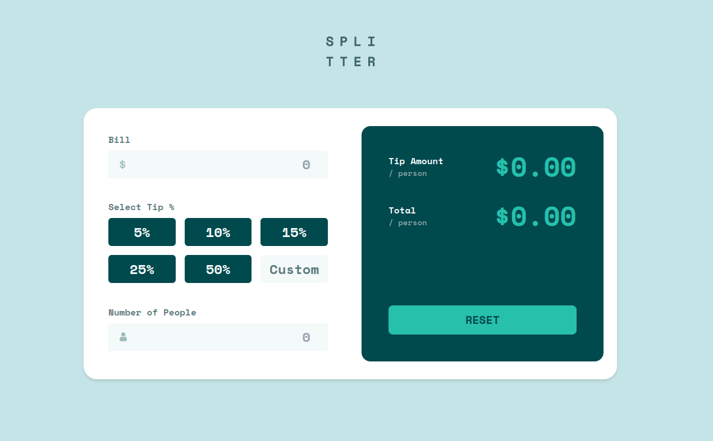
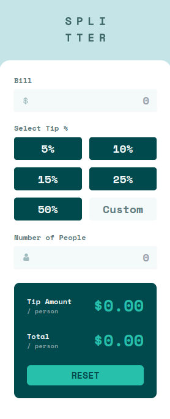

# Frontend Mentor - Tip calculator app solution

This is a solution to the [Tip calculator app challenge on Frontend Mentor](https://www.frontendmentor.io/challenges/tip-calculator-app-ugJNGbJUX).

## Table of contents

- [Overview](#overview)
  - [Screenshot](#screenshot)
  - [Links](#links)
- [My process](#my-process)
  - [Built with](#built-with)
- [Author](#author)

## Overview

### Screenshots

### Links

- Solution URL: [Frontend Mentor IO Solution](https://www.frontendmentor.io/solutions/stats-preview-card-component-4thGx7DsIJ)
- Live Site URL: [Hosted on GitHub Pages](https://filipjanik00.github.io/stats-preview-card-component-main/)

## My process

### Built with

- Semantic HTML5 markup
- Tailwind CSS
- Vanilla JavaScript
- Mobile First Workflow

## Author

- Frontend Mentor - [@filipjanik00](https://www.frontendmentor.io/profile/filipjanik00)
